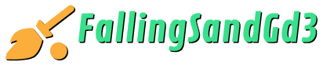

<!-- Note: This README.md is based upon https://github.com/othneildrew/Best-README-Template. Therefore, comments seen in the source for this README may not be project-specific. -->
<!-- Improved compatibility of back to top link: See: https://github.com/othneildrew/Best-README-Template/pull/73 -->
<a name="readme-top"></a>
<!--
*** Thanks for checking out the Best-README-Template. If you have a suggestion
*** that would make this better, please fork the repo and create a pull request
*** or simply open an issue with the tag "enhancement".
*** Don't forget to give the project a star!
*** Thanks again! Now go create something AMAZING! :D
-->

<!--
Here's a blank template to get started: To avoid retyping too much info. Do a search and replace with your text editor for the following: `jt-ziolo`, `FallingSandGd3`, `twitter_handle`, `linkedin_username`, `email_client`, `email`, `Falling Sand Gd3`, `project_description`, `project_description_full`, `MIT`, `codacy_id`, `docs_name`, `jenkins_job_url`

Also find/replace on https://example.com
-->


<!-- PROJECT SHIELDS -->
<!--
*** I'm using markdown "reference style" links for readability.
*** Reference links are enclosed in brackets [ ] instead of parentheses ( ).
*** See the bottom of this document for the declaration of the reference variables
*** for contributors-url, forks-url, etc. This is an optional, concise syntax you may use.
*** https://www.markdownguide.org/basic-syntax/#reference-style-links
-->
<div align="center">

  [![Contributors][contributors-shield]][contributors-url]
  [![Forks][forks-shield]][forks-url]
  [![Stargazers][stars-shield]][stars-url]
  [![Issues][issues-shield]][issues-url]
  [![License][license-shield]][license-url]

<!-- Opting to comment out LinkedIn shield. Assuming that the project has multiple contributors it seems to me that keeping social media links such as LinkedIn on your profile page is a better approach.
[![LinkedIn][linkedin-shield]][linkedin-url]
-->


<!-- PROJECT LOGO -->
  <br />
  <a href="https://github.com/jt-ziolo/FallingSandGd3">
    
  </a>

  <h3 align="center">Falling Sand Gd3</h3>

  <p align="center">
    A simple falling-sand game created using Godot3. Watch grains of various types of elements interact with each other in complicated ways. A learning project inspired by falling-sand games of the mid-to-late 2000s.
    <br />
    <a href="https://github.com/jt-ziolo/FallingSandGd3">Play</a>
    · 
    <a href="https://github.com/jt-ziolo/FallingSandGd3/issues">Report Bug</a>
    ·
    <a href="https://github.com/jt-ziolo/FallingSandGd3/issues">Request Feature</a>
  </p>
</div>

![FallingSandGd3 Screen Shot][product-screenshot]


## Play

See [Releases](https://github.com/jt-ziolo/FallingSandGd3/releases/tag/v1.0.0) for Windows and Linux executable files.

![FallingSandGd3 Screen Shot][product-screenshot-2]


## Getting Started (Development)

To start Godot 3.5 development using this project as a template follow these steps.

#### Prerequisites

This project was developed using a Godot 3.5 standalone install on Ubuntu 22.04.1 LTS and Windows 10, additional steps may be required for development with other installations or on other operating systems.

#### Installation

1. Download the mono (.NET) version of Godot 3.5.1-stable at [https://github.com/godotengine/godot/releases/tag/3.5.1-stable](https://github.com/godotengine/godot/releases/tag/3.5.1-stable)
2. Clone the repo
   ```sh
   git init
   git clone https://github.com/jt-ziolo/FallingSandGd3.git
   ```
3. Open the project under `FallingSandGd3/godot` using Godot
4. Download the GUT (Godot Unit Test) addon v7.4.1 from Godot's built-in AssetLib, or get it at [https://github.com/bitwes/Gut/releases/tag/v7.4.1](https://github.com/bitwes/Gut/releases/tag/v7.4.1), AssetLib places the addon in `./godot/addons/gut/`
5. Shell and batch scripts to run GUT tests are included in `FallingSandGd3/`. See the GUT GitHub repo wiki for additional information on how to configure these scripts.


## Future Plans

This project was created as a learning project; there are no plans for further development at this time. However, I will monitor [open issues](https://github.com/jt-ziolo/FallingSandGd3/issues) for any proposed features and issues and may revisit this project when time allows.


## License

Distributed under the MIT License. See `LICENSE` for more information.


## Contact

JT Ziolo - ziolojt@gmail.com

Project Link: [https://github.com/jt-ziolo/FallingSandGd3](https://github.com/jt-ziolo/FallingSandGd3)


## Acknowledgments

* [Godot Docs - 3.5 branch](https://docs.godotengine.org/en/3.5/)
* [Godot Unit Test (GUT) Framework](https://github.com/bitwes/Gut/releases/tag/v7.4.1)
* [Cabin Sketch Font by Impallari Type](https://fonts.google.com/specimen/Cabin+Sketch/about)

* This project makes use of [Best-README-Template by othneildrew](https://github.com/othneildrew/Best-README-Template), which is distributed under the MIT License.

<p align="right">(<a href="#readme-top">back to top</a>)</p>


<!-- MARKDOWN LINKS & IMAGES -->
<!-- https://www.markdownguide.org/basic-syntax/#reference-style-links -->
[contributors-shield]: https://img.shields.io/github/contributors/jt-ziolo/FallingSandGd3.svg?style=for-the-badge
[contributors-url]: https://github.com/jt-ziolo/FallingSandGd3/graphs/contributors
[forks-shield]: https://img.shields.io/github/forks/jt-ziolo/FallingSandGd3.svg?style=for-the-badge
[forks-url]: https://github.com/jt-ziolo/FallingSandGd3/network/members
[stars-shield]: https://img.shields.io/github/stars/jt-ziolo/FallingSandGd3.svg?style=for-the-badge
[stars-url]: https://github.com/jt-ziolo/FallingSandGd3/stargazers
[issues-shield]: https://img.shields.io/github/issues/jt-ziolo/FallingSandGd3.svg?style=for-the-badge
[issues-url]: https://github.com/jt-ziolo/FallingSandGd3/issues
[license-shield]: https://img.shields.io/github/license/jt-ziolo/FallingSandGd3.svg?style=for-the-badge
[license-url]: https://github.com/jt-ziolo/FallingSandGd3/blob/master/LICENSE
<!--
[linkedin-shield]: https://img.shields.io/badge/-LinkedIn-black.svg?style=for-the-badge&logo=linkedin&colorB=555
[linkedin-url]: https://linkedin.com/in/linkedin_username
-->
<!-- TODO [play-url]: https://example.com -->
[product-screenshot]: images/screenshot.png
[product-screenshot-2]: images/screenshot-2.png
